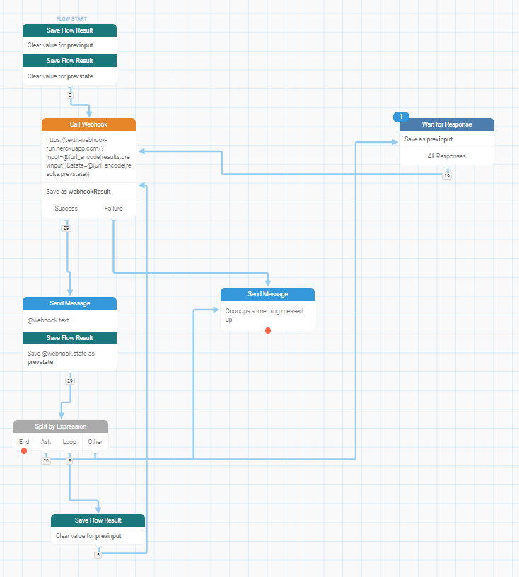
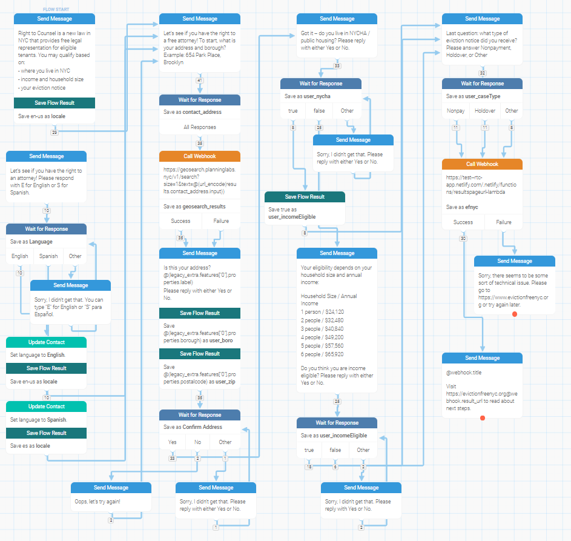
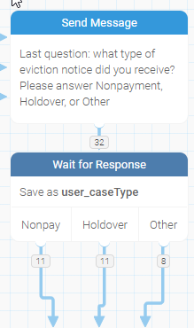

This is an attempt to model a [RapidPro][]/[TextIt][] flow as a finite state machine
that is defined in textual source code, rather than visually as a flow diagram.

[RapidPro]: https://rapidpro.io/
[TextIt]: https://textit.in/

## The problem

At [JustFix.nyc][], we currently use TextIt as the "router" for all our SMS
needs: that is, whenever someone sends a text to our phone number, it's handled
by TextIt.  This was great for initial prototyping but has become suboptimal
in some ways as our organization has evolved:

* The only people who ever change the TextIt flows and campaigns are engineers,
  who are already fluent with code, while the primary audience of TextIt is
  non-coders. This isn't a big deal for very simple flows, but as conversation
  logic becomes more complex, we've found that it'd be easier to just write the
  "business logic" ourselves in code, rather than create a spaghetti-like flow
  diagram in TextIt.

* It can be difficult to test our flows to ensure that they work as expected; for
  instance, RapidPro/TextIt doesn't have concepts like unit testing or type safety,
  which can greatly improve reliability and shorten the development cycle.

* Changes to flows are difficult to detect and roll-back in case of
  failure; in contrast, a git repository and the workflows offered by platforms
  like GitHub make it easy to track and control changes.

* Most actual user data is stored in our [Tenant Platform][], not
  TextIt, which makes accessing it cumbersome.

[JustFix.nyc]: https://www.justfix.nyc/
[Tenant Platform]: https://github.com/JustFixNYC/tenants2

## A solution

One way to alleviate these issues is by implementing the *entire* flow in code
as a finite state machine (FSM), exposing it via a RESTful API, and creating an
almost-trivial TextIt flow that simply delegates to the FSM:



Another interesting aspect of this solution is that it's not particularly
coupled to TextIt, which makes it easy to migrate if we ever decide to
move away from that platform.

## About this prototype

This prototype implements the [Eviction Free NYC][EFNYC] web-based screener as
a textbot.  The following is a rough outline of what the conversation flow
looks like, which was taken from a pre-existing TextIt flow:



Since it's a prototype, it has a number of limitations:

* Data and code leveraged from other codebases was simply copy-pasted into
  this prototype; a production version would avoid such duplication.

* There's not really any error handling/reported. Unexpected/nonsensical user
  input is handled, but not e.g. network errors/timeouts or assertion failures.

* Localization isn't addressed at all.

* It has no unit tests.

[EFNYC]: https://www.evictionfreenyc.org/en-US/

### Using the prototype

You'll need NodeJS and yarn.

First install dependencies:

```
yarn install
```

Then run the following to start both the TypeScript compiler in watch
mode, and the development server:

```
yarn start
```

At this point you can use the console-based version of the prototype in
a separate terminal by running:

```
yarn console
```

#### Connecting the prototype to TextIt

Actually connecting the prototype to TextIt takes a bit more work:

1. You'll first need to expose the development server to the internet by
   either punching a hole in your firewall or using a tool like [ngrok][].

   Alternatively, you can deploy the prototype to Heroku via
   `git push heroku master` (assuming you've properly configured the
   repository with the `heroku` CLI).

   Yet another way you can deploy the prototype is via AWS Lambda.
   You can build the JS bundle for the lambda function by running
   `yarn lambda`, and then copy-paste the contents of
   `lambda.bundle.js` into your Lambda function's code editor in
   the AWS management console.

2. Next, you'll want to [import the TextIt flow][import] in
   [`textit-flow.json`](./textit-flow.json) into your TextIt account,
   and change the base URL of its single webhook node to match your
   deployment's endpoint.

[ngrok]: https://ngrok.io/
[import]: https://help.nyaruka.com/en/articles/1911231-importing-a-flow

## Limitations with this approach

* When using a paid service like TextIt (as opposed to self-hosting the
  open-source RapidPro software), this isn't a very efficient use of funds
  because it doesn't leverage many of TextIt's strengths. It's only
  really potentially useful if and when one wants to use TextIt for some
  flows and custom coding for other flows while having both accessible at
  the same phone number.

  (That said, another approach might be to put a custom SMS-receiving
  solution in front of TextIt, and somehow only forward messages
  destined for TextIt to TextIt, perhaps via TextIt's API, but such
  a solution has yet to be explored--if it is even possible.)

* While TextIt isn't an ideal authoring environment for engineers, it
  *is* an easy way for non-technical stakeholders to get a good
  "bird's eye view" of what a flow is like.
  
  Actually, it's arguably even a good way for *technical* stakeholders
  to get such a high-level view too. And we lose that visualization
  when we implement the solution entirely in code (although perhaps
  additional tooling could be built to create such a visualization
  *from* code, it would take extra work to implement).

* TextIt also provides excellent built-in analytics in its flow UI. Here's
  an example:

  

  In the above screenshot, the numbers on the blue lines indicate
  that 32 runs of the flow asked the user what kind of eviction notice
  they received, and of those that answered, 11 answered with "nonpayment",
  11 answered with "holdover", and 8 answered with "other".

  Unfortunately, this prototype's approach obscures such information; though it
  could be retrieved in various ways, none of them are likely to be
  as accessible and convenient as TextIt's built-in functionality.

* As mentioned earlier, the prototype doesn't address localization; it would
  probably be addressed via the same mechanisms we use for localizing
  our web products, e.g. via internationalization tooling like [lingui][]
  or Django's built-in support, with localization workflow handled by
  a tool like [Crowdin][].

  This is another area where TextIt shines, since
  [it supports localization out-of-the-box][textit-l10n] and makes it
  very easy for non-technical translators to contribute. An added benefit
  is that because they have access to the flow diagram, they have a lot of
  context around what they're translating.

  However, one downside of TextIt's approach is also that it's siloed from
  other localization systems: if, for example, our textbots reuse text
  that exists in the web versions of our products, then the localization
  of our web and SMS-based products would be unified, reducing overall
  translation effort. So there are definitely trade-offs involved.

## Related projects

* [toolness/justfix-interview-ts-fun](https://github.com/toolness/justfix-interview-ts-fun) is a 2018 experiment to build a conversational system that could work across many different media including SMS and web.


[lingui]: https://github.com/lingui/js-lingui
[Crowdin]: https://crowdin.com/
[textit-l10n]: https://blog.textit.in/localizing-workflows-to-support-multiple-languages
